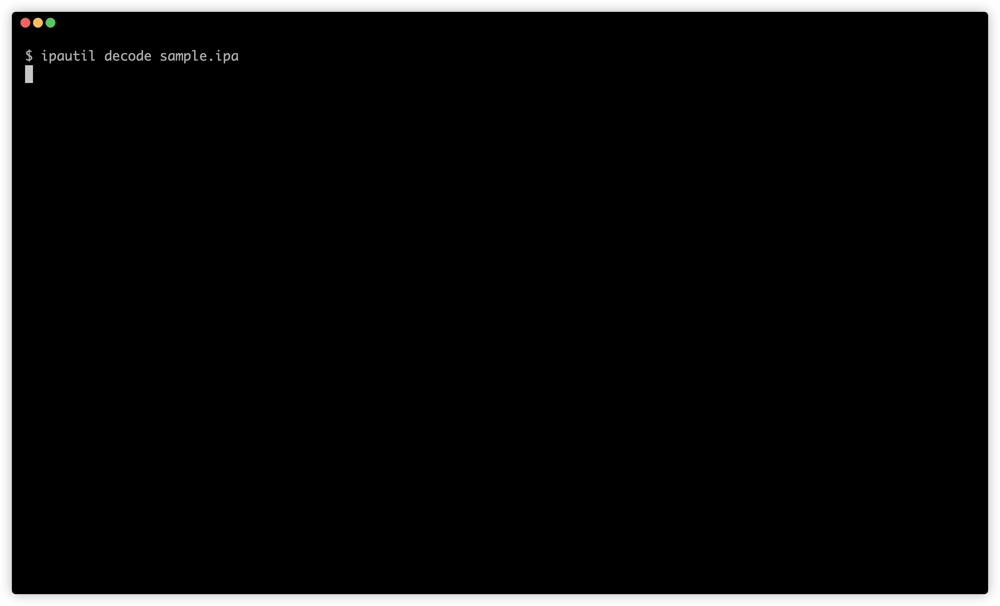

# ipautil

[](https://github.com/aktsk/ipautil/blob/master/LICENSE)

`ipautil` is a useful utility for mobile security testing.
This tool makes it easy to resign the IPA, check for potentially sensitive files and `Info.plist` in the IPA.

It is a wrapper for `codesign` commands.
I've only checked it works on macOS.
Android version is [here](https://github.com/aktsk/apkutil).

## Installation
Since `ipautil` is implemented in Python, it can be installed with the pip command, which is a Python package management system.

```
$ pip install git+ssh://git@github.com/aktsk/ipautil.git
```

Also, place `~/ipautil.json` containing the sign information necessary for signing IPA in your home directory.

```
{
    "entitlements-plist": "/hoge/entitlements.plist",
    "embedded-mobileprovision": "/fuga/embedded.mobileprovision"
}
```

## Usage
The command outputs are displayed in color. You can use a function with subcommands.
The GIF is a scene of resign the IPA.



### subcommands
Most of the subcommands are assigned with alias.

|subcommand  |alias  |desc  |
|---|---|---|
|`info` | `i` | check Info.plist |
|`decode` | `d` | decode IPA |
|`build`  | `b` | build IPA |
|`sign` | `s` | sign IPA |

### info
`info` subcommand allows you to see some information by parsing Info.plist.

```
$ ipautil info Payload/demo-client\ iOS\ develop.app/Info.plist 
Checking Info.plist...
CFBundleName:
demo-client iOS develop

CFBundleDisplayName:
demo-dev

Checking AppTransportSecurity...
True

NSExceptionDomains:
facebook.com

Custom schemas (CFBundleURLSchemes):
None
```

### decode
`decode` subcommand make the IPA decode.
When unzipping the IPA, check for potentially sensitive files and check the Info.plist.

```
$ ipautil decode sample.ipa
Decoding IPA...
Archive: sample.ipa
   creating: Payload/
   creating: Payload/demo-client iOS develop.app/
   creating: Payload/demo-client iOS develop.app/_CodeSignature/
  inflating: Payload/demo-client iOS develop.app/_CodeSignature/CodeResources  
  inflating: Payload/demo-client iOS develop.app/demo-client iOS develop  
...
  inflating: Payload/demo-client iOS develop.app/Info.plist  

CFBundleName:
demo-client iOS develop

CFBundleDisplayName:
demo-dev

Checking AppTransportSecurity...
True

NSExceptionDomains:
facebook.com

Custom schemas (CFBundleURLSchemes):
None

Potentially Sensitive Files:
./Payload/demo-client iOS develop.app/README.md
./Payload/demo-client iOS develop.app/hoge.sh

Output: ./Payload
```

### build
`build` subcommand make the IPA build.
It also sign the IPA by codesign before the build is complete.

```
$ ipautil build Payload
Signing IPA by codesign...
Payload/demo-client iOS develop.app/Frameworks/Hoge.framework: replacing existing signature
Payload/demo-client iOS develop.app/Frameworks/Fuga.framework: replacing existing signature
Payload/demo-client iOS develop.app: replacing existing signature
Signed

Building IPA...
  adding: Payload/ (stored 0%)
  adding: Payload/demo-client iOS develop.app/ (stored 0%)
  adding: Payload/demo-client iOS develop.app/_CodeSignature/ (stored 0%)
  adding: Payload/demo-client iOS develop.app/_CodeSignature/CodeResources (deflated 74%)
  adding: Payload/demo-client iOS develop.app/demo-client iOS develop (deflated 62%)
  ...

Output: demo-client_iOS_develop.app.patched.ipa
```

### sign
`sign` subcommand make the Payload directory sign by codesign.

```
$ ipautil sign Payload/
Signing IPA by codesign...
Payload/demo-client iOS develop.app/Frameworks/Hoge.framework: replacing existing signature
Payload/demo-client iOS develop.app/Frameworks/Fuga.framework: replacing existing signature
Payload/demo-client iOS develop.app: replacing existing signature
Signed
```

## License
MIT License
